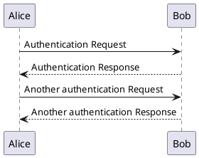

## 導入

XXX

## この記事を読んでわかること

- XXX

## 目次

1. PlantUMLとは
   1. コメントするべきではないこと
2. Javaのインストール
3. Graphvizのインストール
4. gatsby-remark-plantumlのインストール
5. 

## PlantUMLとは

XX

gatsbyの公式ページをもとに環境をセットアップしていきます。  

[gatsby-remark-plantuml](https://www.gatsbyjs.com/plugins/gatsby-remark-plantuml/)

## Javaのインストール

Javaのインストール方法については[こちらの記事](../posts/00005)を参照してください。  

## Graphvizのインストール

Graphvizのインストール方法については[こちらの記事](../posts/00005)を参照してください。  

## gatsby-remark-plantumlのインストール

PlantUMLで記載したコードブロックをSVGイメージに変換するためにGatsby Remarkプラグインをインストールします。


``` bash
npm install --save gatsby-transformer-remark gatsby-remark-plantuml
```

``` bash
//実行ログ
rui@ruinoMacBook-Pro gatsby-r-blog % npm install --save gatsby-transformer-remark gatsby-remark-plantuml
npm WARN @pmmmwh/react-refresh-webpack-plugin@0.4.1 requires a peer of react-refresh@^0.8.3 but none is installed. You must install peer dependencies yourself.
npm WARN @typescript-eslint/eslint-plugin@2.34.0 requires a peer of eslint@^5.0.0 || ^6.0.0 but none is installed. You must install peer dependencies yourself.
npm WARN @typescript-eslint/parser@2.34.0 requires a peer of eslint@^5.0.0 || ^6.0.0 but none is installed. You must install peer dependencies yourself.
npm WARN acorn-dynamic-import@4.0.0 requires a peer of acorn@^6.0.0 but none is installed. You must install peer dependencies yourself.
npm WARN connected-react-router@6.8.0 requires a peer of seamless-immutable@^7.1.3 but none is installed. You must install peer dependencies yourself.
npm WARN eslint-config-react-app@5.2.1 requires a peer of eslint@6.x but none is installed. You must install peer dependencies yourself.
npm WARN eslint-loader@2.2.1 requires a peer of eslint@>=1.6.0 <7.0.0 but none is installed. You must install peer dependencies yourself.
npm WARN eslint-plugin-react-hooks@1.7.0 requires a peer of eslint@^3.0.0 || ^4.0.0 || ^5.0.0 || ^6.0.0 but none is installed. You must install peer dependencies yourself.
npm WARN gatsby-interface@0.0.166 requires a peer of gatsby@2.6.0 but none is installed. You must install peer dependencies yourself.
npm WARN gatsby-interface@0.0.166 requires a peer of react@16.8.1 but none is installed. You must install peer dependencies yourself.
npm WARN gatsby-interface@0.0.166 requires a peer of react-dom@16.8.1 but none is installed. You must install peer dependencies yourself.
npm WARN gatsby-remark-katex@3.3.11 requires a peer of katex@^0.10.0 but none is installed. You must install peer dependencies yourself.
npm WARN netlify-cms-widget-code@1.2.2 requires a peer of codemirror@^5.46.0 but none is installed. You must install peer dependencies yourself.
npm WARN netlify-cms-widget-list@2.6.3 requires a peer of netlify-cms-lib-widgets@^1.0.0 but none is installed. You must install peer dependencies yourself.
npm WARN netlify-cms-widget-relation@2.8.3 requires a peer of netlify-cms-lib-widgets@^1.0.0 but none is installed. You must install peer dependencies yourself.
npm WARN react-codemirror2@6.0.1 requires a peer of codemirror@5.x but none is installed. You must install peer dependencies yourself.
npm WARN react-redux@4.4.10 requires a peer of redux@^2.0.0 || ^3.0.0 but none is installed. You must install peer dependencies yourself.
npm WARN theme-ui@0.2.52 requires a peer of @mdx-js/react@^1.0.0 but none is installed. You must install peer dependencies yourself.

+ gatsby-transformer-remark@2.8.32
+ gatsby-remark-plantuml@0.7.0
added 4 packages from 40 contributors, removed 27 packages, updated 1 package and audited 3544 packages in 25.681s

207 packages are looking for funding
  run `npm fund` for details

found 0 vulnerabilities

rui@ruinoMacBook-Pro gatsby-r-blog %
```

### JDKのインストール


## gatsby-config.js修正

### gatsby-transformer-remark用設定追加

`gatsby-remark-plantuml`を追加します。  
読み込みの関係で`gatsby-remark-prismjs`より前に設定する必要があるようです」。  

``` javascript
// In your gatsby-config.js
plugins: [
  {
    resolve: `gatsby-transformer-remark`,
    options: {
      plugins: [
        {
          resolve: 'gatsby-transformer-remark',
          options: {
            plugins: [
              ・・・
              {
                resolve: 'gatsby-remark-plantuml',
                options: {
                  maxWidth: '480',
                  attributes: 'max-width: 480;'
                }
              },
              'gatsby-remark-prismjs',
              ・・・
            ]
          }
        },
      ],
    },
  },
]
```

###  動作確認

マークダウンにplant umlの文法を記載すると、無事シーケンス図が表示されました！




